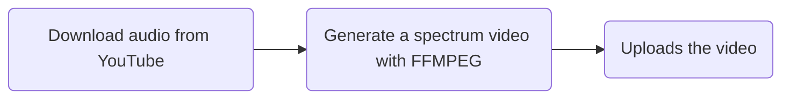

## Musicvid Automator 🔁

#### About

This is an CL program built with `Node.js` and `FFMPEG` to automates the workflow that Non-Copyright music YouTube channels have. From a Youtube URL, it executes this workflow:

It has some depedencies that are critical and may stop working, such as [`ytdl-core`](https://github.com/distubejs/ytdl-core). So, if this program doesn't work, please, check this dependency.

#### Run - Docker recommended ⚓️

1. First you need a `client_secret.json` on the root dir, a OAuth 2.0 key generated on your Google Cloud project
2. Run `docker build -t musicvid-automator .`
3. Run `docker run -it --rm musicvid-automator`
4. The program will ask you to click a link to authorize the app to use your YT channel.
5. At the end the browser will try to open a link that starts with `http://localhost/?code=...`, you should paste in the terminal the code between `?code=` and `&scope=` (64 characters). Once the app is authorized will won't need to repeat this.
